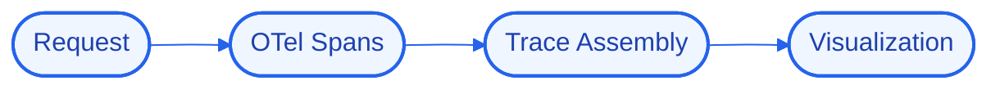

# TraceMap
### Distributed tracing that follows a request across every service it touches.


## 📖 Overview
TraceMap instruments services with OpenTelemetry and stitches spans into end-to-end traces, so I can see exactly where latency and errors originate across the system.

> Part of my Senior Hybrid Engineer 2026 portfolio (`#43`). Built on the "Antigravity" model — logic, state, and UI run locally in Docker while heavy reasoning is offloaded to cloud APIs, so the whole system runs on modest hardware.

## 🚀 Quick Start
```bash
# 1. Clone
git clone https://github.com/Kimosabey/trace-map.git
cd trace-map

# 2. Install
# (see docs/GETTING_STARTED.md for the full setup)

# 3. Run
docker compose up
```

## ✨ Key Features
- End-to-end distributed traces
- Context propagation across services
- Latency breakdown per span
- Error attribution to a service

## 🏗️ Architecture


Propagating trace context cleanly across async boundaries so traces stay complete.

See [docs/ARCHITECTURE.md](./docs/ARCHITECTURE.md) for the full HLD/LLD and design decisions.

## 🧰 Tech Stack
| Layer | Technology | Role |
| :--- | :--- | :--- |
| OpenTelemetry | `OpenTelemetry` | Distributed tracing |
| Node.js | `Node.js` | Application runtime / service layer |

## 📚 Documentation
- [Architecture](./docs/ARCHITECTURE.md) — high- and low-level design, decision log
- [Getting Started](./docs/GETTING_STARTED.md) — prerequisites, setup, environment
- [Failure Scenarios](./docs/FAILURE_SCENARIOS.md) — fault analysis and recovery
- [Interview Q&A](./docs/INTERVIEW_QA.md) — deep-dive walkthrough

## 🔭 Future Enhancements
- Sampling strategies
- Trace-based alerting
- Service dependency map

## 📄 License
Released under the MIT License.

## 👤 Author

**Harshan Aiyappa**
Senior Full-Stack Hybrid AI Engineer
Voice AI • Distributed Systems • Infrastructure

[](https://kimo-nexus.vercel.app/)
[](https://github.com/Kimosabey)
[](https://linkedin.com/in/harshan-aiyappa)
[](https://x.com/HarshanAiyappa)
